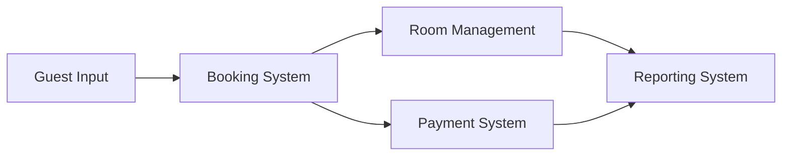

# System Analysis Document

## 1. System Overview

### 1.1 System Description

The Hostel Management System is a comprehensive web-based application designed to automate and streamline hostel operations. It handles room management, bookings, guest management, and administrative tasks.

### 1.2 Business Context

-   Primary Users: Hostel staff, administrators, guests
-   Key Business Processes: Room booking, guest management, payment processing
-   Business Goals: Improve efficiency, reduce manual work, enhance guest experience

## 2. Stakeholder Analysis

### 2.1 Primary Stakeholders

-   Hostel Management

    -   System administration
    -   Financial oversight
    -   Strategic decision making

-   Staff Members

    -   Daily operations
    -   Guest check-in/check-out
    -   Room management

-   Guests
    -   Room booking
    -   Payment processing
    -   Service requests

### 2.2 Secondary Stakeholders

-   Maintenance Staff
    -   Room maintenance
    -   Facility upkeep
-   External Service Providers
    -   Payment gateway services
    -   Cleaning services
    -   Security services

## 3. Process Analysis

### 3.1 Core Business Processes

1. **Booking Process**

    ```mermaid
    graph TD
        A[Guest Inquiry] --> B[Check Availability]
        B --> C{Room Available?}
        C -->|Yes| D[Create Booking]
        C -->|No| E[Suggest Alternatives]
        D --> F[Process Payment]
        F --> G[Send Confirmation]
    ```

2. **Check-in Process**
    ```mermaid
    graph TD
        A[Guest Arrival] --> B[Verify Booking]
        B --> C[Collect ID]
        C --> D[Process Payment]
        D --> E[Assign Room]
        E --> F[Provide Keys]
    ```

### 3.2 Support Processes

1. **Room Maintenance**

    - Regular inspections
    - Cleaning schedule
    - Repairs management
    - Inventory tracking

2. **Financial Management**
    - Payment processing
    - Refund handling
    - Financial reporting
    - Audit trails

## 4. Data Analysis

### 4.1 Data Entities

1. **Guest Data**

    - Personal information
    - Contact details
    - Booking history
    - Payment records

2. **Room Data**

    - Room details
    - Availability status
    - Maintenance records
    - Pricing information

3. **Booking Data**
    - Reservation details
    - Check-in/out times
    - Special requests
    - Payment status

### 4.2 Data Flow



## 5. System Requirements Analysis

### 5.1 Functional Dependencies

1. **Booking Management**

    - Room availability check
    - Guest registration
    - Payment processing
    - Confirmation system

2. **User Management**
    - Authentication
    - Authorization
    - Role management
    - Access control

### 5.2 System Interfaces

1. **External Interfaces**

    - Payment gateway
    - Email service
    - SMS service
    - Analytics tools

2. **User Interfaces**
    - Admin dashboard
    - Staff interface
    - Guest portal
    - Mobile interface

## 6. Risk Analysis

### 6.1 Technical Risks

| Risk               | Probability | Impact | Mitigation                   |
| ------------------ | ----------- | ------ | ---------------------------- |
| Data Loss          | Low         | High   | Regular backups, redundancy  |
| System Downtime    | Medium      | High   | Monitoring, failover systems |
| Security Breach    | Low         | High   | Security audits, encryption  |
| Performance Issues | Medium      | Medium | Optimization, scaling        |

### 6.2 Business Risks

| Risk               | Probability | Impact | Mitigation                     |
| ------------------ | ----------- | ------ | ------------------------------ |
| User Adoption      | Medium      | High   | Training, user-friendly design |
| Process Changes    | High        | Medium | Change management plan         |
| Competition        | Medium      | Medium | Feature differentiation        |
| Regulatory Changes | Low         | High   | Compliance monitoring          |

## 7. Feasibility Analysis

### 7.1 Technical Feasibility

-   Required technology stack is readily available
-   Development team has necessary expertise
-   Infrastructure requirements are achievable
-   Integration points are well-defined

### 7.2 Economic Feasibility

-   Development costs within budget
-   Expected ROI within 18 months
-   Maintenance costs are sustainable
-   Training costs are reasonable

### 7.3 Operational Feasibility

-   Staff capable of operating system
-   Business processes can be adapted
-   Training requirements are manageable
-   System aligns with operational goals

## 8. Recommendations

### 8.1 Implementation Strategy

-   Phased rollout approach
-   Pilot testing with limited users
-   Gradual feature deployment
-   Continuous feedback collection

### 8.2 Success Metrics

-   System uptime > 99.9%
-   User satisfaction > 85%
-   Processing time reduction > 50%
-   Error rate < 1%

## 9. Appendices

### 9.1 Analysis Methods Used

-   Business Process Modeling
-   Data Flow Analysis
-   Risk Assessment Matrix
-   Cost-Benefit Analysis

### 9.2 Supporting Documentation

-   Process flow diagrams
-   Data models
-   User interviews
-   Market research data
